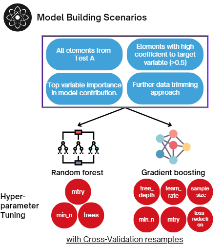

```{r setup, include=FALSE}
knitr::opts_chunk$set(echo = FALSE, cache=TRUE, messages=FALSE, warning=FALSE)
library(monash)
library(bookdown)
library(tidyverse)
library(knitr)
library(kableExtra)
library(tinytex)
library(corrplot)
library(ggcorrplot) 
library(gridExtra)
library(moments)
library(visdat)
library(patchwork)
library(MLmetrics)
theme_set(theme_minimal())
```

\newpage
# Abstract


# Background and Motivation

## Critical elements overview

In this technology advancement era where mineral-based technologies are relied by many industrial sectors, critical elements become highly-sought elements in the world [@Emsbo2021]. Critical elements can be defined by two main criteria: first, elements that are essential for manufacturing modern technologies, supporting economic frameworks, and ensuring national security; and second, elements with vulnerable supply chains, which can be affected by political issues, geographic concentration of extraction or production, and natural disasters [@Lian2024; @Fortier2018; @DISR2023].

According to [Critical Minerals Strategy 2023–2030](https://www.industry.gov.au/publications/critical-minerals-strategy-2023-2030) [@geoscience2023], Geoscience Australia has identified 15 elements as highly vulnerable to future supply chain disruptions and additional 15 elements as moderate risk, which defined in Table \ref{tab:celist} [@Coyne2023; @Skirrow2013; @IEA2024b; @Fortier2018; @Austrade2024]. Among these critical elements, Rare Earth Elements (REE) represent a significant subset. REEs are a group of 17 chemically similar metallic elements composed of fifteen lanthanides, scandium, and yttrium. They further grouped into light (LREEs) and heavy (HREEs) based on their atomic number, electron arrangement, and chemical properties [@Reid2018]. Ultimately, critical elements (including REE) are crucial for many high-tech industries, including electronics, renewable energy, and defense [@Huang2018].

Global initiatives to reduce carbon emissions by transitioning to clean energy have led to increasing demand for critical elements, which are essential resources for achieving this goal [@IEA2021; @Wang2022]. According to @IEA2024 research, demand for these elements is projected to double, triple, or even quadruple, depending on the scenario, relative to current production levels. Among these elements, lithium is experiencing the most rapid growth due to rising demand for electric vehicle (EV) batteries, while copper leads in terms of production volume. Graphite demand is expected to almost quadruple, and the demand for nickel, cobalt, and rare earth elements (REEs) is projected to double. Furthermore, @Fortier2018 indicates that the growing reliance on critical elements is also driven by their applications across various key sectors, including energy, defense, communications, healthcare, transportation, and agriculture. These dynamics have intensified competition to discover new sources and establish stable, long-term supply chains for these vital resources [@Emsbo2021]. The prominent usage of each element and its projected demand are also detailed in Table \ref{tab:celist}.

```{r celist, include=TRUE, message = FALSE, warning = FALSE, eval = TRUE, echo = FALSE, out.width = '100%'}

CE_list <- tibble("Critical Element" = c("Aluminum and derivative (Al)","Cobalt (Co)","Gallium (Ga)","Germanium (Ge)",
                            "Lithium(Li)","Magnesium(Mg)","Manganese(Mn)", "Nickel(Ni)","Rare-earth elements (REE)", 
                            "Silicon (Si)", "Tantalum (Ta)", "Titanium (Ti)","Tungsten (W)","Vanadium (V)","Zirconium (Zr)", 
                            "Antimony (Sb)", "Arsenic (As)",  "Beryllium (Be)", "Bismuth (Bi)", "Chromium (Cr)",
                            "Fluorine (F)","Graphite (Gr)", "Hafnium (Hf)", "Indium (In)", "Molybdenum (Mo)",
                            "Niobium (Nb)", "Platinum-group elements (PGE)", "Rhenium (Re)", "Selenium(Se)","Tellurium (Te)"),
 
 "Production (Kilotonnes)" = c(20,5.9,"-","-",61,2.6,3.3,150,18,0.05,0.057,0.85,"-","-",0.5,4,"-","-","-", 66.1,"-","-","-","-","-",
                     "-","<0.01","-","-","-"),
 
 "Global Production (Percentage)" = c("14","3","-","-","47","10","17","4.5","6","1","3","8.4","-",
                             "-","36","4","-","-","-","0.3","-","-","-","-","-","-","<0.01","-","-","-"),
 
 "Projected Demand (Kilotonnes)" = c("-",243.03,0.25,0.03,615.55,30.95,855,2792.68,61.96,2025,0.44,22.69, 0.17,35.23,11.14,"-","0.55",
                           "-","-",823.7,"-",8406.7,0.02,0.17,104.44,1.97,0.03,"-",0.26,1.55),
 
 Usage = c("Aerospace alloys, Coating in Li-ion batteries","Li-ion battery cathodes, stainless steels, superalloys",
          "Radar, light-emitting diodes (LEDs), photovoltaics films","Fiber/infrared optics, Polymerization Catalysts, 
          semiconductors","Li-ion batteries, aerospace alloys, ceramics","Pyrotechnics, nanocomposites in automotive/aerospace",
          "Steel, Agricultural fertilizer, lightweight alloys","Cathodes of Li-ion batteries, Non-ferrous alloys",
          "Catalysts, magnets, guidance, lasers","Solar PVs, Silicon wafers in electronic and photovoltaic cells",
          "Micro-capacitors, superalloys", "Aerospace and marine alloys, pigment","Lightning, Cutting and drilling tools, 
          catalysts","Steel or aerospace alloys","Cladding fuel rods, nuclear reactors","Flame retardant, lead-acid batteries",
          "Microwave communications, pesticides, semiconductors","Satellite communications, lightweight alloys",
          "Pharmaceuticals, lead-free solders, cosmetics","Steel or aerospace alloys, leather tanning","Refrigerants, dental care, 
          nuclear processing","Rechargeable batteries, semiconductors and sensors, water filtration","Nuclear reactors, 
          aerospace alloys","Flat-panel displays, low-Melting Alloys, semiconductors","Improving strength and corrosion resistance 
          in steel alloys","High-Strength Low-Alloy (HSLA) Steel, superalloys, superconductors, welding", 
          "Catalysts, jewelry, thermocouples","Superalloys, catalysts, electrical Contacts, filaments","Alloying agents, solar cells, 
          glass production","Copper or steel alloys, semiconductors, solar cells, thermoelectric Materials"),
 
 "Level" = c(rep("High",15),rep("Moderate",15))
 )

colnames(CE_list)[2] <- paste(colnames(CE_list)[2], footnote_marker_number(1))
colnames(CE_list)[4] <- paste(colnames(CE_list)[4], footnote_marker_number(2))
colnames(CE_list)[5] <- paste(colnames(CE_list)[5], footnote_marker_number(3))

CE_list[9,1] <- paste0("Rare-earth elements (REE)",footnote_marker_alphabet(2))
CE_list[27,1] <- paste0("Platinum-group elements (PGE)",footnote_marker_alphabet(3))
CE_list[8,2] <- paste0(CE_list[8,2],footnote_marker_alphabet(1))

CE_list <- CE_list |> mutate(Level = cell_spec(Level, background = ifelse(Level == "High", "#F7D7DC", "#FDA"), format="latex")) 

kbl(CE_list,
      format = "latex", 
      align = "c",
      escape = FALSE,
      booktabs = TRUE,
      longtable = TRUE,
      caption = "\\textbf{Summary of Critical Elements: Production, Global Share, Projected Demand, and Usage}") %>%
  kable_styling(latex_options = c("hold_position", "repeat_header"),
                full_width = TRUE,
                font_size=9) %>%  
  column_spec(5, width = "5cm") %>% 
  footnote(number = c("Skirrow et al., 2013 & Coyne and Campbell, 2023;", "IEA, 2024b;", "Fortier et. al., 2018; Austrade, 2024"),
           number_title = "Source:",
           footnote_as_chunk = TRUE) %>% 
  footnote(alphabet = c("Data collected in 2012.", "17 elements, including lanthanoid, Scandium (Sc), and Yttrium (Y).", 
                        "6 elements, including all transition metals in the d-block."))

```


As one of the promising top global producers of these critical elements, Australia, with its abundant deposit and technological expertise, plays a pivotal role in the sustainable energy transition and supply chain stability. Australia is the largest producer of lithium, the third largest producer of cobalt, and the fourth largest producer of rare earths. It also produces significant amounts of aluminium, nickel, and copper, which are essential for low-emission technologies like electric vehicles, solar panels, and wind turbines [@DISR2023]. Australia's Government strategy to ensure the fulfillment of this potential has been proactive and multifaceted, especially in the past 5 years. The strategy include a range of incentives, finance facilities, grants and other support for the critical elements sector. Some of the important initiatives as reported in @DISR2023, are:

1). The Australian Government’s Critical Minerals Facility, with AUD 4 billion budget, supports projects that are aligned with the nation’s Critical Minerals Strategy and serve the national interest.

2). The Northern Australia Infrastructure Facility (NAIF) allocates up to AUD 500 million of the AUD 5 billion to help finance projects in the Northern Territory, Queensland, and Western Australia.

3). The Junior Minerals Exploration Incentive (JMEI) promotes investment in small minerals-exploration firms that focus on greenfield exploration.

4). Australian federal, state and territory government authorities are collaborating on the AUD 10 million Critical Minerals National Productivity Initiative to develop pre-feasibility studies of common-user infrastructure for the critical elements sector.

5). The Major Projects Facilitation Agency (MPFA) supports developers of projects over AUD 20 million by providing information on Australian Government regulations and approvals, mapping out critical approval processes, and communicating with regulators to address issues. 

6). The Critical Minerals Production Tax Incentive offers a production incentive worth 10 percent of relevant processing and refining costs for Australia’s 31 critical elements. This incentive is available for up to 10 years per project for production between 2027–28 and 2039–40, provided the projects reach final investment decisions by 2030.


## Critical elements in coals
The green technology initiatives and commitments by countries worldwide for decarbonization have led to a growing market of clean energy and technology. As a result, critical elements, including REE, are projected to be in high demand in the future [@usde2017]. Currently, China leads the world in REE production, dominating the international trade and global value chain of rare earths [@us2024mineral]. However, their recent export restrictions on REE have led to a disruption in the global supply chain [@MANCHERI2015262]. In response, there is an increasing focus on identifying alternative sources of critical elements, with coal being explored as a potential new source of critical elements [@Hodgkinson2021].  

In @Hodgkinson2020 element mapping project on Bowen basin Table \ref{tab:concentration}, the largest coal reserves in Australia, the concentration of element  composition is subjective to sample's lithology rather than the depth grading:

1). In coal and its derivatives, although the majority of element concentrations fall below the benchmark when compared to Post-Archaean Australian Shales (PAAS) standard [@McLennan2011], a widely used geochemical reference material in the  average composition of shales, local samples exhibit enrichment in Heavy Rare Earth Elements (HREEs) and scandium(Sc). Additionally, concentrations of the critical element bismuth (Bi) are abnormally elevated, showing levels 4-6 times higher than the crustal average.

2). Siltstone and mudstone yield unremarkable findings in terms of elemental enrichment, with most element concentrations failing to meet significant thresholds. However, the concentration of cobalt compounds approaches the crustal average, suggesting potential economic value that warrants further investigation.

3). Tuffaceous rock, formed from volcanic ash, is rich in pumice and lithic fragments. Samples reveal elevated concentrations of strategic elements, including Rare Earth Elements (REEs), gallium (Ga), and bismuth (Bi). Moreover, a potential lithium-rich borehole has been identified, with lithium concentrations approximately five times higher than the crustal average.

```{r concentration, include=TRUE, message = FALSE, warning = FALSE, eval = TRUE, echo = FALSE, out.width = '100%'}
table2_c <- tibble("Critical Element" =c("Lithium","REE","Cobalt","Nickel","Tantalum","Vanadium","Zirconium","Gallium",
                                         "Bismuth","Chromium","Niobium","Molybdenum"),
                   "PAAS Standard" = c(21,184,17,47,1,97, 193,17,0.2,92,12,1),
                   "Average Concentration (ppm)" = c(13.7,115.8,16.9,11.2,0.33,85.6,102.1,12.3,0.59,14.33,7.9,1.33),
                   "Highest Concentration (ppm)" =c (25,205,30,40,1,140,160,25,1,51,32,3),
                   "Above Crustal Average (Percentage)" = c(2/9,1/9,4/9,0,1/3,2/9,0,4/9,2/3,0,1/9,7/9)
                   )


table2_sm <- tibble(
                    "Critical Element" = c ("Lithium","REE","Cobalt","Nickel","Tantalum","Vanadium","Zirconium","Gallium",
                                            "Bismuth","Chromium","Niobium","Molybdenum"),
                    "PAAS Standard" = c(21,184,17,47,1,97,193, 17,0.2,92,12,1),
                    "Average Concentration (ppm)" = c(17.2,138.8,39.3,25.8,0.2,102,116.8,15,0.18,51.33,4.67,0.67),
                    "Highest Concentration (ppm)" = c(28,189,134,73,1,225,243,22,0.4,266,8,1),
                    "Above Crustal Average (Percentage)" = c(1/3,1/6,2/3,1/3,1/6,1/3,1/6,1/3,2/3,1/6,0,2/3)
                    )


table2_tf <- tibble(
                    "Critical Element" = c("Lithium","REE","Cobalt","Nickel","Tantalum","Vanadium","Zirconium","Gallium",
                                           "Bismuth","Chromium","Niobium","Molybdenum"),
                    "PAAS Standard" = c(21,184,17,47,1,97,193, 17,0.2,92,12,1),
                    "Average Concentration (ppm)" = c(21.5,244,9.25,3.75,1.1,27.9,153.75,32.25,0.71,0,9.63,1),
                    "Highest Concentration (ppm)" = c(105,441,19,30,2,70,282,37,1.2,0,18,5),
                    "Above Crustal Average (Percentage)"= c(1/8,7/8,1/8,0,1,0,1/4,1,1,0,1/4,1/2)
                    )

table2_bind <- rbind(table2_c, table2_sm, table2_tf)

table2_bind <- table2_bind|>
                mutate(`Above Crustal Average (Percentage)` = round(`Above Crustal Average (Percentage)`*100),
                       `Average Concentration (ppm)` = cell_spec(`Average Concentration (ppm)`, 
                                                                "latex", 
                                                                 bold = ifelse(`Average Concentration (ppm)` > `PAAS Standard`, TRUE, FALSE)),
                       `Highest Concentration (ppm)`= cell_spec(`Highest Concentration (ppm)`, 
                                                               "latex",
                                                               bold = ifelse(`Highest Concentration (ppm)` > `PAAS Standard`, TRUE, FALSE)))


kable(table2_bind,
      align = "c",
      format = "latex",
      escape = FALSE,
      booktabs = TRUE,
      caption = "\\textbf{Summary of Hodginkson's research on critical element mapping in coal mines}",
      linesep = '',
      longtable = TRUE) %>%
    kable_styling(latex_options = c("repeat_header"), full_width = TRUE,
                font_size=9) %>%
    pack_rows("Coal Seam & Associate", 1, 12) %>%
    pack_rows("Siltstone & Mudstone", 13, 24) %>%
    pack_rows("Tuffaceous Rocks", 25, 36) %>%
    footnote(general = "Adapted from Hodginkson et al., 2020",
             general_title= "Source: ",
             footnote_as_chunk = T)

```


## Economic concentrations
Before the recent surge in demand, extracting critical elements (including REE) from coal was considered costly, however, methods have been developed that reduce the cost and also enviromentally friendly. Coal and coal byproducts are substantially enhanced with trace metals and have been proposed as a potential source [@Eterigho2021]. A report by US Department of Energy suggests that extracting REEs from coal material already mined for other purposes, either as a dual product or byproduct, could be more cost-effective than a dedicated REE mining. Despite the challenge of processing large volumes to obtain economic concentrations, cost may be reduced due to the pre-processed (mined, crushed, and washed) state of the materials and transported to areas with existing infrastructure [@usde2017; @Hodgkinson2021]. Based on research, the elements and metals in coal that are considered to have the best chance for economic recovery are: REE, Ag, Au, PGEs, Be, Se, V, Ga, Sb, Sc, Mo, W, Re, Ge, U, Y, Nb, Zr, Al [@DAI2018155].

Efficient extraction of critical elements from coal or coal ash, and finding coal sources with highly elevated concentrations of these elements, are essential prerequisites. The value of the element in any coal sources largely determined by their concentration, which varies based on geological and geochemical conditions. Therefore, to economically recovering critical elements from coal is by identifying sources with the highest critical elements levels and accessibility first before proceeding to extraction and recovery stages [@Eterigho2021]. @Reid2018 in his report suggests that critical elements average level in coal is typically just 35 ppm, which is insufficient for economic extraction. While @Seredin2012 in their reports suggests that a cutoff grade for Rare Earth Oxides (ROE) for coal seam has been suggested as 800-900 ppm. Table \ref{tab:cutoff-grade} provide suggested cut-off grade for 18 critical elements. Additionally, @TALAN2022107897 reports that coal sources are often relatively enriched in the heavy rare earths (HREEs, Ho, Er, Tm, Yb, Lu) and critical rare earths (CREEs, Y, Nd, Dy, Eu, Tb) compared to traditional mineral deposits. A cut-off grade of 115–130 ppm rare earth element on a whole mass basis may be considered economical. However, the U.S. Department of Energy set a criterion in their work assessing raw coal with total rare earth element content greater than 300 ppm on a whole dry coal basis. 

```{r cutoff-grade, include=TRUE, message = FALSE, warning = FALSE, eval = TRUE, echo = FALSE, out.width = '100%'}

CE_cutoff <- data.frame(
  `Critical elements` = c("U", "Ge", "V", "Se", "Ga", "REE", "Y", "Sc", "Nb", "Zr", "Mo", "Re", "Wi", "Au + Pt + Pd", "Ag", "Be", "Sb", "Cs"),
  `Suggested cut-off grade` = c(1000, 300, 1000, "500–800", "100 (50)", 1000, 300, 100, 300, 2000, 1000, 1, 1000, 2, 10, 300, 1000, 150)
)

kable(CE_cutoff, 
      booktabs = T,
      format = "latex",
      align = "c",
      escape = FALSE,
      caption = "\\textbf{Selected critical elements with their suggested cut-off grade (ppm)}",
      col.names = c("Critical Element", "Suggested Cut-off Grade")) %>%
  kable_classic_2(full_width = F) %>%
  footnote(general = "Adapted from Dai and Finkelman, 2018",
           general_title = "Source: ",
           footnote_as_chunk = T)
```


## Existing economic deposits
Currently, there are no coal mines or coal basins extracting critical elements (including REE) at a commercial states. Most sources found conclude that we are still in the research and development process [@Hodgkinson2020; @DAI2018155; @Eterigho2021; @osti_1808639; @TALAN2022107897]. A report by @Eterigho2021 suggests that the research and development are primarily at the laboratory and pilot scale stages. For example, scholars like Honaker and coworkers who have significant experience in this subject, have constructed a 0.23 t/h solid feed pilot plant for testing different coal-based feedstocks [@osti_1808639]. However, commercial-scale extraction processes have not yet been widely implemented. @TALAN2022107897 report support this finding as well. They propose a potential approach for commercial-scale extraction of critical elements, indicating ongoing effort to bridge the gap between laboratory research and commercial application. Additionally, they note that further validation and techno-economic analysis are required before these processes can be scaled up commercially. Furthermore, scholars who focusing their research on China's coal resources also suggest further research is needed to scale up the extraction process [@Qin2015; @Qin2015b; @Liu2024; @Zhao2019; @ZOU2023105245]. Given that China is the leader in critical elements production, this fact indicates that their production of critical elements does not primarily come from coal and its byproducts. 

We can conclude that significant research and development efforts have been made towards commercial extraction of critical elements from coal and coal byproducts. However, it is still long way from actual large-scale implementation. Most scholars indicate the necessity of considering sustainability factors. Effective waste management and treatment, along with the evaluation of extraction costs and technical feasibility, are important. At the end of the day, these elements are going to be utilised in green technology initiatives, such as renewable energy systems and electric vehicles, which demand high-purity materials. Ensuring that their extraction processes are environmentally and economically sustainable is crucial to align with the goals of these green technologies initiatives. Furthermore, ongoing research is vital to bridge existing technology gaps and develop robust, scalable methods that can transition from pilot projects to commercial operations. 


## Extraction of critical elements
There are several stages required for critical elements can be extracted from coal and coal byproducts. Coal and coal byproducts is first prepared by crushing and milling to release the organic from inorganic elements to generate fine concentrates. These concentrates are then undergo further separation techniques such as physical (froth flotation, electrostatic, magnetic, gravity) and chemical (leaching). Later, it will further processed into purification to extract the REE into pure oxide form (e.g. REO). REO can be standalone products, however, market demand dictates their conversion into metals. Thus, in the refining stage, using an electrolysis or a metallothermic reduction process, REOs will be converted into high-purity rare earth metals. These metals may then be alloyed with other elements to make them harder and stronger for the end-use market [@Eterigho2021; @usde2017; @TALAN2022107897]. The figure \ref{fig:ree-vc} visualise this process.

```{r ree-vc, fig.align = "center", out.width = '100%', fig.cap="REE Value Chain (Source: US Department of Energy, 2017)"}
knitr::include_graphics("/cloud/project/Final_report/Final_report_files/figure-latex/Critical_Mineral_Extraction_Process_v2.png")
```

Recently, water-leaching is a prevailing  approach since it mitigate the flaw from traditional techniques. Water leaching can be considered as  less environmentally detrimental compared to strong acid/alkaline leaching, as well as cost effective for solvent selection. The  crucial stages on this preparation workflow  are low temperature activation and water leaching.  During the stage of low temperature activation, the chemical reaction within coal fly ash (CFA) will be facilitated by complexation agents (ammonium salts or weak acids) in covered alumina crucibles, which  help liberate critical elements from the matrix of the CFA. After the activation and cool down to ambient temperature, the tablets are placed in water for the leaching and dissolve process. Water acts as the leaching solvent, extracting these soluble elements into the leachate.The configuration in temperature and mass ratio of solvent will be the vital determinant for optimized recovery. Take Lithium  example, it can achieve a stable leaching efficiency of 90% through ammonium fluoride leaching at 150°C with a $SiO_2/NH_4F$ mass ratio of 1:1.35 @Xu2021. 

Another innovation is Hydrophobic-Hydrophilic Separation (HHS), designed to leverages the disparity  of affinity (water-repellent & water-friendly) properties of substances to achieve separation.It can treat as a complementary application for small particle delamination without size limit, providing flexible and extensible purpose in the segregation of ultrafine coal @Hodgkinson2021.


In precious @Hodgkinson2020 element mapping  project on Bowen basin,the largest coal reserves in Australia, the concentration of element  composition is subjective to sample's lithology rather than the depth grading:


1). In coal and derivative,  albeit majority of element concentrations is inferior of the benchmark against earth crust average, local  samples exhibit  enrichment in HREE and Scandium in respect to @McLennan2011 Post-Archaean Australian Shales (PAAS) standard , while abnormal 4-6 times higher than crustal average in moderate  critical element, Bismuth(Bi) .

2). Siltstone and mudstone has a lackluster finding to classify enrichment for majority of elements concentration,except for  the concentration of Cobalt compound barely meet crustal average,  whose ubiquitous economic value may warrant further examination.

3).  As the sediment from volcanic ash, tuffaceous rock is rich in pumice and lithic fragments. The sample display a series of  elevated concentrations of  strategic elements including REE, Ga and Bi. Besides, a potential Lithium-rich borehole is found, with approximate 5 times higher than crustal average.


# Objectives and Significance
The primary objective of this study is to develop a predictive model using machine learning and spatial statistics to identify and quantify critical minerals—such as copper, lithium, nickel, cobalt, and rare earth elements—in coal mine waste. By analyzing existing coal data, this study aims to provide valuable insights into the potential recovery of these essential minerals from coal deposits, contributing to waste reduction and supporting the transition to low-emission technologies. The outcome of this study will help assess the economic value of these minerals and promote sustainable practices within the mining and energy sectors.

The study utilises multiple datasets, some of which are publicly available while others are confidential. The public dataset was released by the Australian Coal Industry's Research Program (ACARP) in 2021, whereas the confidential data comes from Matrix Geoscience's clients. Although the datasets originate from different sources, both contain information on the concentration of various critical elements sampled from coal mines and power plants across Australia. Additionally, the study employs data on elemental concentrations from Post Archean Australian Shale (PAAS), which represents the background crustal abundance of elements. This comparison helps determine whether the elemental concentrations in the coal samples exceed typical crustal abundance levels.

This study is significant because it addresses a critical gap in understanding the presence and potential recovery of valuable minerals from coal mine waste. By employing advanced machine learning and spatial statistics techniques, the project has the potential to revolutionise how the mining industry views coal waste—transforming it from an environmental challenge into a resource opportunity. The findings could contribute to more sustainable mining practices, reduce waste, and support the global transition to low-emission technologies by securing a local supply of critical minerals. Furthermore, this research could pave the way for further exploration of coal mine waste as a valuable resource in other regions, creating economic and environmental benefits on a broader scale.

# Data

## Data source and description
As the escalating research into this flourishing market, the largest national scientific research institution, CSIRO (Commonwealth Scientific and Industrial Research Organisation) in Australia Federation has initiated the early-stage research into the potential of element extraction in coal mines. Launched in 2001, The C29030 project in Australian Coal Industry's Research Program (ACARP) [@Hodgkinson2021] has gauged the first comprehensive map of element concentration in Australian coal and provided the open dataset for testing result. This element mapping targets on 50 elements that has rarely studied from nearly 90 samples in Queensland and New South Wales, which are carefully selected in 13 coal mines and power plants to represent 6 basins, covering a range of coal measures and seams of varying ages. The dataset is a wide format excel spreadsheet, with the information of detected element name and their corresponding concentration in parts per million (ppm) for each labelled sample(e.g.2648CR01), as well as the sample's coordinate in a separate record.

Simultaneously, private-sector analyses are also promptly emerging, utilising a variety of advanced analytic techniques, including four-acid digestion with ICP-AES and fusion-based acid digestion with ICP-MS. Although the report format is not standardised (long or wide format), but all of them cover basic information for element name and concentration as well as additional borehole composite index in ppm, which is sufficient for further deep-dive investigation.

Eventually, PAAS file attached to [@McLennan2011] Post-Archean Australian Shale normalised score, representing the average composition of shale formed after the Archean eon, which is a geochemical reference baseline in the comparison of element enrichment  in this report.


## Initial Data Analysis and wrangling process

To prepare for exploratory data analysis and predictive modeling, different data formats must be collated into a standardised structure, which involves converting the data into a long format and trimming the trivial variables to ensure consistency and readiness for further analysis. The cleaning data will include `element symbol`, `elment value in ppm` and `project region` only, but other specific cleaning requirements still need to be addressed. First and foremost, The private projects are unable to disclose the location in detail, therefore; they will be replaced to Confidential A, B and C respectively. Furthermore, partial element values are recorded as character due to their undetected status(nd) and subtle presence(`<` sign). a value of `-999.00` will be assigned to represent their negative relationship without compromising data integrity. Another significant issue in data wrangling is the sample duplication, mainly because cross detection methods are applied in their analysis. To resolve this, we will remain the element concentration value for the most precise observation range.

After the preliminary tidying, the data is organised and concise but some information is still lacking in subsequent study. Since the analytic technique will only detect single element, the critical element groups like REE and it's subcategories are absent in calculation. the element list need to be expanded by the aggregation of the concentration values from their corresponding symbols.  Additionally, the data must be joined with PAAS file and normalised value should be derived by using formula $\text{Normalized value}= \frac{\text{Element value(ppm)}}{\text{PAAS score(ppm)}}$, along with Boolean flag for enrichment (above background, >=1). The final step is replacing outliers and missing values by the median value within their respective project. If no project-specific values are available the global median of the element will be applied. The median replacement is a mild imputation  to ensure the robustness and consistency of data structure and in turn, maintain data integrity without distorting the subsequent modelling.

```{r}
# Loading all data
alldata <- readRDS('/cloud/project//results/all_data.rds')
```

In a nutshell,  The final cleaning data include total `r ncol(alldata)` variables and `r nrow(alldata)` observations. Figure \ref{fig:visdat} shows the correct data type for all variables, with no missing value left.
```{r visdat, fig.cap="n at-a-glance of final data wrangling result"}
alldata |> vis_dat()
```

# Exploratory Data Analysis

The Exploratory Data Analysis (EDA) was carried out on critical elements concentration data, which provide information about the concentration of critical mineral across different areas in Australia that has been normalised using PAAS (Post-Archean Australian Shale) standard. The primary objective of this analysis is to gain a deeper understanding of the data's structure and key characteristics. Through this, we aim to identify significant trends, correlations, and outliers that may influence the outcomes of the study. 

The EDA for critical elements concentration data starts with a descriptive statistics for every critical elements included in the data. These summary statistics can be found in the Table \ref{tab:desc-stats}. The descriptive statistics features include the minimum value of the critical elements, maximum value, the mean, the median, the standard deviation, and the kurtosis of the variable.

```{r desc-stats, include=TRUE, message = FALSE, warning = FALSE, eval = TRUE, echo = FALSE}

# Populate descriptive stats table
desc_stats <- alldata %>%
  group_by(Element_Symbol, Element_Description) %>%
  summarise(min = min(PAAS_normalised_value),
         max = max(PAAS_normalised_value),
         mean = mean(PAAS_normalised_value),
         median = median(PAAS_normalised_value),
         sd = sd(PAAS_normalised_value),
         kurtosis = moments::kurtosis(PAAS_normalised_value))

kable(desc_stats,
      format = "latex", 
      align = "c", 
      escape = TRUE,
      booktabs = TRUE,
      col.names = gsub("[_]", " ", names(desc_stats)),
      digits = 3, 
      format.args = list(big.mark = ",", scientific = FALSE),
      longtable = TRUE,
      caption = "\\textbf{Descriptive Statistics of Elements' Normalised Value}") %>%
  kable_styling(latex_options = c("repeat_header"), 
                full_width = TRUE,
                font_size=9) %>%
  column_spec(2, extra_css = "max-width: 15px; word-wrap: break-word; overflow-wrap: break-word;")
```

The most important statistics from this table is kurtosis. Kurtosis measures the combined weight of the tails of a distribution relative to its centre. In this way, we can use kurtosis as an indicator of the presence of outliers. A high kurtosis values is indicative of outliers. The summary statistics suggest that Al, Ba, Bi, Ce, Co, Cr, Cs, Cu, Fe, Mn, Nb, and Ni are having many outliers due to high kurtosis value. Validating the outliers will be easier with data visualisation, which will be presented in the next step.

The next step was analysing the distribution of each element's normalised value. By utilising boxplots, it will help identifying the outliers of each critical elements, while also identifying which element's has median value above the PAAS standard. Obtaining these information will help to understand whether certain element is naturally abundance in the nature, thus it is most likely economically efficient to extract. The figure \ref{fig:element-dist} provide these informations.
```{r element-dist, fig.cap = "Distribution of Critical Elements (Box-Plot)", out.width = "100%", fig.width = 10, fig.height = 6, fig.align = "center"}
bp1 <- alldata %>%
  filter(Element_Symbol %in% c("Ag","Al","Au","Ba","Be","Bi","Cd","Ce","Co","Cr","Cs","Cu","Dy",
                               "Er","Eu","Fe","Ga", "Gd","Ge","Ho","In","La","Li","Lu","Mn","Mo")) %>%
  ggplot(aes(x = PAAS_normalised_value, y = Element_Symbol)) +
  geom_vline(xintercept = 1, linetype = 2, color = "red") +
  xlab("PASS Normalised Value") +
  ylab("Element Symbol") +
  geom_boxplot() +
  theme_minimal()

bp2 <- alldata %>%
  filter(Element_Symbol %in% c("Nb","Nd","Ni","Pb","Pr","Rb","Re","Sc","Sm","Sn","Sr","Ta","Tb",
                               "Th","Tl","Tm","U","V","Y","Yb","Zn","Zr","REE","REEY","LREE","MREE","HREE")) %>%
  ggplot(aes(x = PAAS_normalised_value, y = Element_Symbol)) +
  geom_vline(xintercept = 1, linetype = 2, color = "red") +
  xlab("PASS Normalised Value") +
  ylab("Element Symbol") +
  geom_boxplot() +
  xlim(0, 45) +
  theme_minimal()

grid.arrange(bp1, bp2, ncol = 2)
```

The boxplots shows some critical points that can be summarised as follow:

- Medians: Most of the elements have their medians close to 0, indicating that the majority of the values are low or concentrated around a lower range. Considering that the threshold to define whether a sample is below/above background is 1 (vertical red dashed line), some elements that have median above the threshold are Re, Ag, Au, Mo, Bi, Li, Cu, Eu, Dy, Gd, Sm, Lu, Yb, Tm, Tb, MREE, Er, Ho, U, Ga, Y, Pb, Nd, Sc, REEY, REE, Th, V, Pr, LREE
- Spread and Variability: The elements exhibit varying degrees of spread. For example, Ge shows a wide range with its box stretching from a low value near 0 to a higher value around 10, indicating a large variability. On the opposite side, elements like Mn, Fe, Cr, Co, Rb, Ni, HREE have very narrow IQR, indicating less variability.
- Outliers: Several elements have significant outliers, as indicated by the dots outside the whiskers of the box plots. For instance, Ge, Bi, Mn, and Ba show notable outliers far from the main data range. Additionally, some elements that was reported from table \ref{tab:desc-stats}, which have high kurtosis are Al, Ba, Bi, Ce, Co, Cr, Cs, Cu, Fe, Mn, Nb, and Ni. These outliers suggest the presence of some unusually high or low values for these elements, which could be of interest for further investigation.
- Symmetry and Skewness: Some elements like Ge, Bi, and Ag appear to have a right skew, with longer whiskers or outliers extending to the right, indicating that the distribution of their normalised values has a tail on the higher end. Elements like Ga and Sm show a more symmetrical distribution with whiskers extending fairly equally on both sides of the box.
- Comparison Accross Elements: Ge stands out with a particularly large spread and median, making it an outlier among the elements. Conversely, many rare earth elements (REE, REEY, MREE, LREE, HREE) have relatively low medians and a small spread, indicating that their normalised values are generally low and clustered.

# Methodology
The framework of modelling methodology in this project fully adheres on Tidymodels R-package [@tidymodels]:

```{r modelbuilding,fig.cap = "The mindset of model build-up in predivtive analysis"}

```


## Stratified sampling and Initial split

Unlike simple random sampling, stratified sapling is deployed to preserve the diversity of project's key feature across the training and test datasets, which leads to unbiased predictive modeling. However, some projects have  limited borehole samples measured in the laboratory and their patterns might not be adequately presented in the initial data split. Thus, the project-based aggregation in terms of the classification within correlation matrix offers an effective solution to mitigate this bias. To properly address the hidden pattern in the neighbor similarity against global matrix, The approach incorporates completed pairwise method to neglect NA in correlation calculation and all element in the list.[@Menon2020]

Figure \ref{fig:globalmat} shows the global correlation matrix of element in full project. Most of the pairwise element tend to display weak positive relationship, represented by light red grids in the heatmap.
```{r globalmat, fig.width=10, fig.height=10, fig.cap="Correlation heatmap of element in full project"}
all_data_wide<-all_data  |>
  select(Project_Name,Sample_ID,Element_Symbol,Element_Value_ppm)  |> 
  filter(Element_Value_ppm!=-999.00 ) |>
  pivot_wider(names_from = Element_Symbol,values_from = Element_Value_ppm)


## Replace outlier

replace_outliers_and_log <- function(data, project_var, target_vars) {
  # Create an empty data frame to track replaced values
  outlier_log <- data.frame(Project_Name = character(),
                            Element = character(),
                            Original_Value = numeric(),
                            Replaced_Value = numeric(),
                            stringsAsFactors = FALSE)

  # Loop through each target variable and apply the replacement logic
  for (target_var in target_vars) {
    # Calculate the median of the target variable for each Project_Name
    medians <- data %>%
      group_by({{ project_var }}) %>%
      summarize(project_median = median(.data[[target_var]], na.rm = TRUE)) %>%
      ungroup()
    
    # Join the median values back to the original data
    data <- data %>%
      left_join(medians, by = rlang::as_name(enquo(project_var))) %>%
      rename(!!paste0("median_", target_var) := project_median)  # Rename to unique median column for each variable
    
    # Calculate IQR and identify outliers for the target variable globally
    Q1 <- quantile(data[[target_var]], 0.25, na.rm = TRUE)
    Q3 <- quantile(data[[target_var]], 0.75, na.rm = TRUE)
    IQR <- Q3 - Q1
    lower_bound <- Q1 - 1.5 * IQR
    upper_bound <- Q3 + 1.5 * IQR
    
    # Replace outliers directly in the target variable and log replaced values
    data <- data %>%
      mutate(
        # Replace outliers with the median value specific to the Project_Name
        replaced_value = ifelse(.data[[target_var]] < lower_bound | .data[[target_var]] > upper_bound, .data[[paste0("median_", target_var)]], NA),
        # Log the original value and the replaced value in the log dataframe
        outlier_flag = !is.na(replaced_value)
      )
    
    # Create a log of replaced values
    temp_log <- data %>%
      filter(outlier_flag) %>%
      transmute(
        Project_Name = .data[[rlang::as_name(enquo(project_var))]],
        Element = target_var,
        Original_Value = .data[[target_var]],
        Replaced_Value = replaced_value
      )
    
    # Combine with the main log dataset
    outlier_log <- bind_rows(outlier_log, temp_log)
    
    # Replace the actual outliers in the original data
    data <- data %>%
      mutate(!!target_var := ifelse(outlier_flag, replaced_value, .data[[target_var]])) %>%
      # Remove temporary columns
      select(-paste0("median_", target_var), -replaced_value, -outlier_flag)
  }
  
  return(list(cleaned_data = data, outlier_log = outlier_log))
}
# Extract the cleaned data and the log of replaced values
all_data_wide <- result$cleaned_data|> 
mutate(across(where(is.numeric), ~ ifelse(is.na(.), median(., na.rm = TRUE), .)))
outlier_log <- result$outlier_log
col_names<- colnames(all_data_wide[, which(names(all_data_wide) == "Ag"):which(names(all_data_wide) == "HREE")])

result <- replace_outliers_and_log(all_data_wide, Project_Name, col_names)

cor_all_data<- all_data_wide |> 
  select(-Project_Name, -Sample_ID )|>
    cor( use="pairwise.complete.obs" )
cor_all_data |> ggcorrplot(method ="square", type ="lower",
                              outline.color ="white",
                               ggtheme = ggplot2::theme_dark(),
                                colors = c("#6D9EC1", "white", "#E46726")
)+ggtitle("Correlation heatmap of element in full project")

```
The project  can be fitted into 4 different types:


```{r}


## call unique sample
regions <- unique(all_data$Project_Name)

## Remove Oaky Creek with only 1 sample
regions<-regions[-14]

corr_plots <- list()

for(i in seq_along(regions)){
cor_matrix_all<-all_data_wide |>
  filter( Project_Name == regions[i]) |>
  select( -Project_Name, -Sample_ID)|>
  cor( use="pairwise.complete.obs" )

corr_p2<-cor_matrix_all |> ggcorrplot( method ="square", type ="lower",
                              outline.color ="white",
                               ggtheme = ggplot2::theme_dark(),
                                colors = c("#6D9EC1", "white", "#E46726")
)+ggtitle(paste( regions[i]))+ 
  theme(axis.text.x = element_text(angle = 90, vjust = 0.5, hjust = 1,size=8),
        axis.text.y = element_text(size=8))
## Adjust the text label position in x axis

corr_plots[[i]] <- corr_p2
}


```
1). Neighbor matrix has a stronger positive relationship than global correlation matrix, including the regions in `Collinsville`,`Newlands` and `Coppabella`.


```{r fig.width=12, fig.height=12, fig.cap="The example of project correlation matrix  with  stronger positive relationship"}
wrap_plots(corr_plots[c(9,10,13)], nrow=2)
```
2). Neighbor matrix has a stronger negative relationship than global correlation matrix, which is a pervasive scenario including the regions in  `Moorvale`,`Wandoan`, `Confidential_C`, `Confidential_A` etc. 9 regions.
```{r fig.width=12, fig.height=12, fig.cap="The example of project correlation matrix  with  stronger negative relationship"}
wrap_plots(corr_plots[c(12,15,2,16)], nrow=2)
```

3). Grid-like distribution format are observed in `Rolleston`, `Collingwood Park` and `Unamed` because these projects only detected  a smaller category of element's sample. Therefore, the matrix structure will structured as a stronger, discrete blocks of correlation. The Oaky Creek project only obtained single sample will also be classified in this type.

```{r fig.width=12, fig.height=12, fig.cap="The example of project correlation matrix  with  grid format"}
wrap_plots(corr_plots[c(1,14,8)], nrow=2)
```
4). Located in one of Australia's most significant coal-producing regions, The matrix format in Fort Cooper mine reserve closely resembles the global matrix without distinct differentiation in correlation distribution.
```{r fig.width=10, fig.height=10, fig.cap="The example of project correlation matrix  in Fort Cooper region"}
corr_plots[4][[1]]
```
Based on this strata division, the raw data will be split to training and testing set with 75%-25% proportion.

## Machine learning methods
Two main machine learning method are primarily focused on this project:

The first target is **random forest**(RF). As an enable learning method, it constructs multiple decision trees  through the subsets of the training data by bootstrapping resampling with replacement. In regression method,the final output is processed by a bagging stage, which combines the result from individual tree from all these individual trees by averaging the predictions from each tree. It can remarkably improve predictive accuracy and reduce overfitting comparing with single decision tree.[@ISLR] The engine setting in Tidymodels will be `Ranger` and `randomForest`.

Another target is **gradient boosting tree**(GBT),Also known as stagewise ensemble method. The process begins by initializing the model with a simple estimator in decision tree, sequentially fit the weak learner to new-added tree. Each subsequent model  focuses on the mistakes made by the earlier trees and tries to correct the residuals of the previous model, until a satisfactory level of performance is reached. GBT particularly works well in REE,HREE and LREE prediction because it learns iteratively, allowing it to capture intricate patterns and nonlinear relationships within the data, especially when subtle patterns are important. The engine setting in Tidymodels will be `xgboost`.[@ISLR]

However, both of two methods are vulnerable for overfitting problem in model training. In model fitting practice, except for the regular approaches to use all elements in ME-4ACD81, additional variable sub-setting and observation trimming techniques are introduced in the comparison with origin method to evaluate the optimal performance, including the conditions of:

1).Predictors with high coefficient to target variable (>0.5) 

2).Top variable importance in model contribution

3).Removing outliers or low-quality data points that may skew the model's performance. 


## Hyperparameter tuning

Hyperparameter tuning is a critical step in optimizing machine learning models, where the goal is to find the best combination of parameter setting that maximizes predictive performance. In this study, hyperparameters were carefully adjusted under the Tidymodels framework in R. Three key hyperparameters were the top prioritized in tuning:

1). **mtry** (Number of Predictors to Sample): Controls the number of predictors considered at each split in a decision tree. A smaller mtry introduces more variability among trees, while a larger mtry can lead to more accurate splits but risks in overfitting problem.

2). **min_n**(Minimal terminal node size):  Determines the minimum number of observations in the ending node. Smaller values allow trees to grow deeper, capturing more details in training data, while larger values lead to simpler models that may generalize better.

3).**trees**(Number of Trees): Define the the total number of decision trees in the ensemble. More trees generally improve performance but also increase computational cost.

To determine the best combination of these hyperparameters in the grid, k-fold cross-validation was employed. The cross validation can help to evaluate a model's performance by splitting the training data into multiple subsets. In each iteration, the model is trained on all but one fold and validated on the remaining fold, repeating this process across all folds.  By averaging the performance metrics across these iterations, cross-validation provides a reliable estimate of how well the model generalizes to new, unseen data.

## Metrics evaluation

There are two type of regression metrics are utilized in performance evaluation. The first principal metrics is R-squared, which is use to mesausre the proportion of model variance can be explained by independent variables and error-related metrics between predicted and actual value like, RMSE, MAE and MAPE. In general comparison, higher r-squared with lower error variability tend to indicate a better-fitting model.
# Results 


## HREE
```{r}

all_data |>
select(Project_Name,Sample_ID,Element_Symbol,Element_Value_ppm)  |>
filter(Element_Value_ppm!=-999.00 & Element_Symbol %in% element_lree)|>
  ggplot() +geom_density( aes(x=Element_Value_ppm))+facet_wrap(.~Element_Symbol,  scales = "free_y")
```
```{r}
all_data_wide<-all_data  |>
  select(Project_Name,Sample_ID,Element_Symbol,Element_Value_ppm)  |> 
  filter(Element_Value_ppm!=-999.00 & Element_Symbol %in% HREE) |>
  pivot_wider(names_from = Element_Symbol,values_from = Element_Value_ppm)

# Function to replace outliers directly and create a log of replaced values
replace_outliers_and_log <- function(data, project_var, target_vars) {
  # Create an empty data frame to track replaced values
  outlier_log <- data.frame(Project_Name = character(),
                            Element = character(),
                            Original_Value = numeric(),
                            Replaced_Value = numeric(),
                            stringsAsFactors = FALSE)

  # Loop through each target variable and apply the replacement logic
  for (target_var in target_vars) {
    # Calculate the median of the target variable for each Project_Name
    medians <- data %>%
      group_by({{ project_var }}) %>%
      summarize(project_median = median(.data[[target_var]], na.rm = TRUE)) %>%
      ungroup()
    
    # Join the median values back to the original data
    data <- data %>%
      left_join(medians, by = rlang::as_name(enquo(project_var))) %>%
      rename(!!paste0("median_", target_var) := project_median)  # Rename to unique median column for each variable
    
    # Calculate IQR and identify outliers for the target variable globally
    Q1 <- quantile(data[[target_var]], 0.25, na.rm = TRUE)
    Q3 <- quantile(data[[target_var]], 0.75, na.rm = TRUE)
    IQR <- Q3 - Q1
    lower_bound <- Q1 - 1.5 * IQR
    upper_bound <- Q3 + 1.5 * IQR
    
    # Replace outliers directly in the target variable and log replaced values
    data <- data %>%
      mutate(
        # Replace outliers with the median value specific to the Project_Name
        replaced_value = ifelse(.data[[target_var]] < lower_bound | .data[[target_var]] > upper_bound, .data[[paste0("median_", target_var)]], NA),
        # Log the original value and the replaced value in the log dataframe
        outlier_flag = !is.na(replaced_value)
      )
    
    # Create a log of replaced values
    temp_log <- data %>%
      filter(outlier_flag) %>%
      transmute(
        Project_Name = .data[[rlang::as_name(enquo(project_var))]],
        Element = target_var,
        Original_Value = .data[[target_var]],
        Replaced_Value = replaced_value
      )
    
    # Combine with the main log dataset
    outlier_log <- bind_rows(outlier_log, temp_log)
    
    # Replace the actual outliers in the original data
    data <- data %>%
      mutate(!!target_var := ifelse(outlier_flag, replaced_value, .data[[target_var]])) %>%
      # Remove temporary columns
      select(-paste0("median_", target_var), -replaced_value, -outlier_flag)
  }
  
  return(list(cleaned_data = data, outlier_log = outlier_log))
}

# Example usage for multiple elements (e.g., Pb, Ag, Au) with Project_Name as the reference grouping variable
result <- replace_outliers_and_log(all_data_wide, Project_Name, c("Ag", "Cd", "Co", "Cu", "Li", "Mo", "Ni", "Pb", "Sc", "Tl", "Zn","HREE"))

# Extract the cleaned data and the log of replaced values
all_data_wide <- result$cleaned_data
outlier_log <- result$outlier_log


all_data_trim_hree<- all_data_wide |> filter(Co <=250 & Zn<=250 & Ni<=250 &Li<=250& HREE<=30)
all_data_model_trim_hree<-all_data_trim_hree|> 
mutate(across(where(is.numeric), ~ ifelse(is.na(.), median(., na.rm = TRUE), .)))|> 
  mutate(
    Corr_type = case_when(
    Project_Name %in% c("Collinsville", "Newlands", "Coppabella") ~ "Type A",
    Project_Name %in% c("Rolleston", "Collingwood Park", "Unamed") ~ "Type B",
    Project_Name == "Fort Cooper" ~ "Type C",
    TRUE ~ "Type D"  # .default should be replaced by TRUE for default case
  ))
       
set.seed(123)

trees_split_trim_hree <- initial_split(all_data_model_trim_hree, strata = Corr_type)
trees_train_trim_hree <- training(trees_split_trim_hree)
trees_test_trim_hree <- testing(trees_split_trim_hree)


selected_train_trim_hree <- trees_train_trim_hree |>
  select( Ag:HREE)


selected_test_trim_hree <- trees_test_trim_hree |>
  select( Ag:HREE)
```


```{r}
set.seed(12345)
fb_fit_rf_trim_hree <- rf_spec |>
fit(HREE ~ ., data = selected_train_trim_hree)
fb_fit_rf


rf_pred_trim_hree<- selected_test_trim_hree|>
mutate(pHREE= predict(fb_fit_rf_trim_hree$fit,
selected_test_trim_hree ))


rf_pred_trim_hree |> yardstick::metrics(truth = HREE, estimate = pHREE)
```

```{r}
 rf_pred_trim_hree |> summarise(MAE=MAE(y_pred=pHREE, y_true=HREE),
                                MAPE=MAPE(y_pred=pHREE, y_true=HREE))
```

```{r}
 rf_pred_trim_hree  |>ggplot( aes(pHREE,HREE))+
  geom_point(alpha = 0.7, colour = "black", size = 5) +
theme_minimal() +
  theme(axis.title.x = element_text(size = 20),        
        axis.title.y = element_text(size = 20))+labs(x="Predicted", y="Actual") +geom_abline(slope = 1, intercept = 0, color = "red",linetype="dashed", size=1)  +  # Diagonal line # Diagonal line
  theme(aspect.ratio = 1)  # Set 
```
## LREE

```{r}

element_lree<-c("Ag", "As",
"Cd",
"Co",
"Cu",
"Li",
"Mo",
"Ni",
"Pb",
"Sc",
"Tl",
"Zn",
"LREE")
all_data_wide_lree<-all_data |>
select(Project_Name,Sample_ID,Element_Symbol,Element_Value_ppm)  |>
filter(Element_Value_ppm!=-999.00 & Element_Symbol %in% element_lree) |>
pivot_wider(names_from = Element_Symbol,values_from = Element_Value_ppm)
result <- replace_outliers_and_log(all_data_wide_lree, Project_Name, c("Ag", "Cd", "Co", "Cu", "Li", "Mo", "Ni", "Pb", "Sc", "Tl", "Zn","LREE"))

# Extract the cleaned data and the log of replaced values
all_data_wide_lree <- result$cleaned_data
outlier_log_lree <- result$outlier_log

all_data_model_lree<-all_data_wide_lree |>
mutate(across(where(is.numeric), ~ ifelse(is.na(.), median(., na.rm = TRUE), .))) |>
mutate(
Corr_type = case_when(
Project_Name %in% c("Collinsville", "Newlands", "Coppabella") ~ "Type A",
Project_Name %in% c("Rolleston", "Collingwood Park", "Unamed") ~ "Type B",
Project_Name == "Fort Cooper" ~ "Type C",
TRUE ~ "Type D"  # .default should be replaced by TRUE for default case
))
```
```{r}
all_data_wide_lree

all_data_trim<- all_data_wide_lree |> filter(Co <=250 & Zn<=250 & Ni<=250 &Li<=250)

all_data_model_lree_trim<-all_data_trim |>
mutate_all(~replace(., is.na(.), -999.00)) |>
mutate(
Corr_type = case_when(
Project_Name %in% c("Collinsville", "Newlands", "Coppabella") ~ "Type A",
Project_Name %in% c("Rolleston", "Collingwood Park", "Unamed") ~ "Type B",
Project_Name == "Fort Cooper" ~ "Type C",
TRUE ~ "Type D"  # .default should be replaced by TRUE for default case
))


```
```{r}
## Initial spilt

set.seed(123)

trees_split_trim <- initial_split(all_data_model_lree_trim, strata = Corr_type)
trees_train_trim <- training(trees_split_trim)
trees_test_trim<- testing(trees_split_trim )

selected_train_trim<- trees_train_trim |>
select( Ag:LREE)

selected_test_trim<-trees_test_trim |>
select(Ag:LREE)
```

```{r}
set.seed(12345)
rf_spec_trim <- rand_forest(

mtry = tune(), trees = tune(), min_n = tune()) |>
set_mode("regression") |>
set_engine("ranger")


rf_grid_trim  <-
grid_latin_hypercube(
min_n(),
mtry(range = c(3, 13)),
trees(),
size = 80)


```


```{r}
set.seed(444)
LREE_fold_trim<- vfold_cv(selected_train_trim)

## accelerate the speed for hyperparameter calculation
doParallel::registerDoParallel()

rf_wf_trim <- workflow()|>
add_model(rf_spec_trim )|>
add_formula( LREE~ Ag+Cd+Co+Cu+Li+Mo+Ni+Pb+Sc+Tl+Zn)


rf_rs_trim <-
rf_wf_trim|>
tune_grid(
resamples = LREE_fold_trim,
grid = rf_grid_trim
)

```


```{r dplyr::selectbest}
set.seed(12345)
best_rmse_rf_ranger_trim <-  rf_rs_trim |>
select_best(metric = "rmse")


best_rmse_rf_ranger_trim


best_rsq_rf_ranger_trim<- rf_rs_trim|>
select_best(metric = "rsq")

best_rsq_rf_ranger_trim
```
```{r}
set.seed(12345)
final_wf_rf_ranger_trim <-
rf_wf_trim |>
finalize_workflow(best_rmse_rf_ranger_trim)

final_fit_rf_ranger_trim<-final_wf_rf_ranger_trim |> last_fit(trees_split_trim)

final_tree_rf_ranger_trim<- extract_workflow(final_fit_rf_ranger_trim)

final_tree_rf_ranger_trim
```
```{r}
set.seed(12345)
final_fit_rf_ranger_trim |>
collect_metrics()
```


```{r}
final_fit_rf_ranger_trim$.predictions[[1]] |>
  summarise(MAE=MAE( .pred,LREE),
            MAPE=MAPE(.pred,LREE))
                               
```
```{r}
final_fit_rf_ranger_trim$.predictions[[1]]  |>ggplot( aes(.pred,LREE))+
  
  geom_point(alpha = 0.7, colour = "black", size = 5) +
theme_minimal() +
  theme(axis.title.x = element_text(size = 20),        
        axis.title.y = element_text(size = 20))+labs(x="Predicted", y="Actual") +geom_abline(slope = 1, intercept = 0, color = "red",linetype="dashed", size=1)  +  # Diagonal line # Diagonal line
  theme(aspect.ratio = 1)  # Set 
```

# Discussions


# Conclusion


# Appendix


\newpage

# Reference

